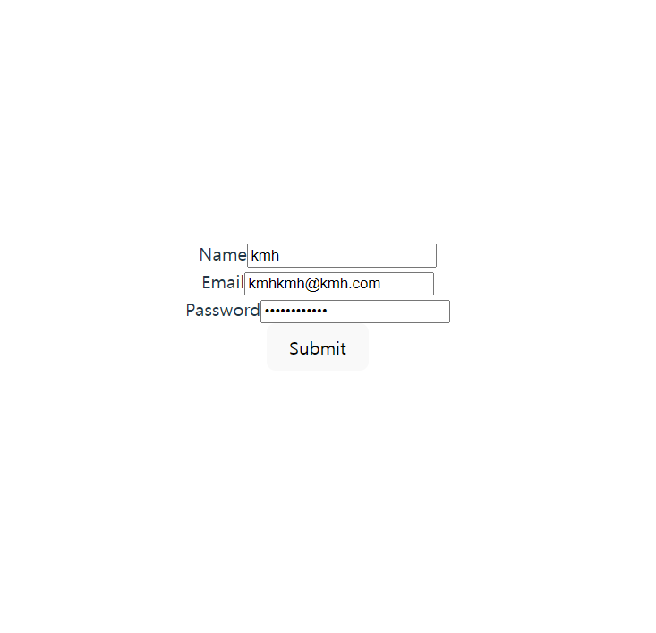
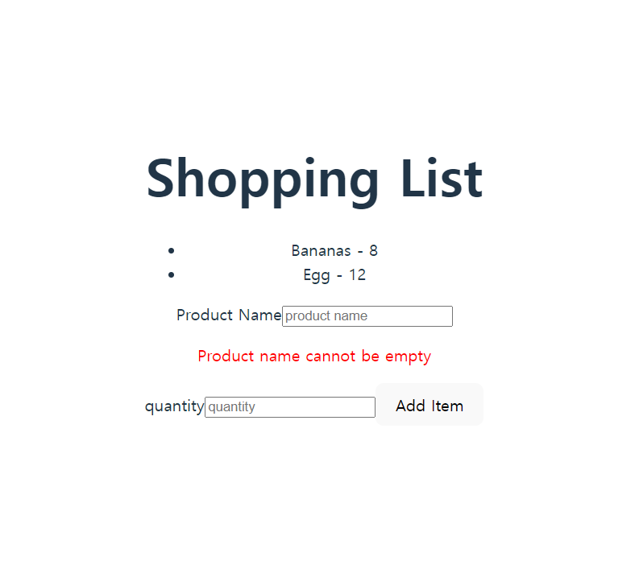
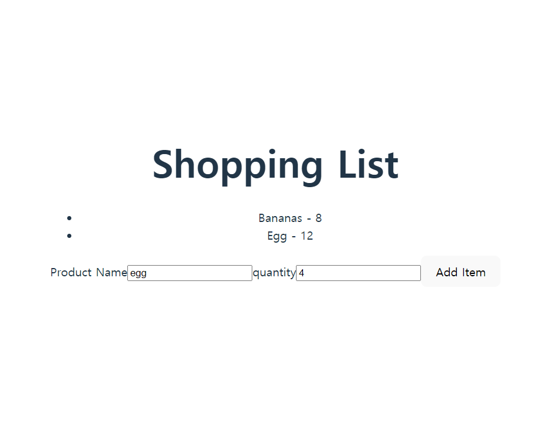
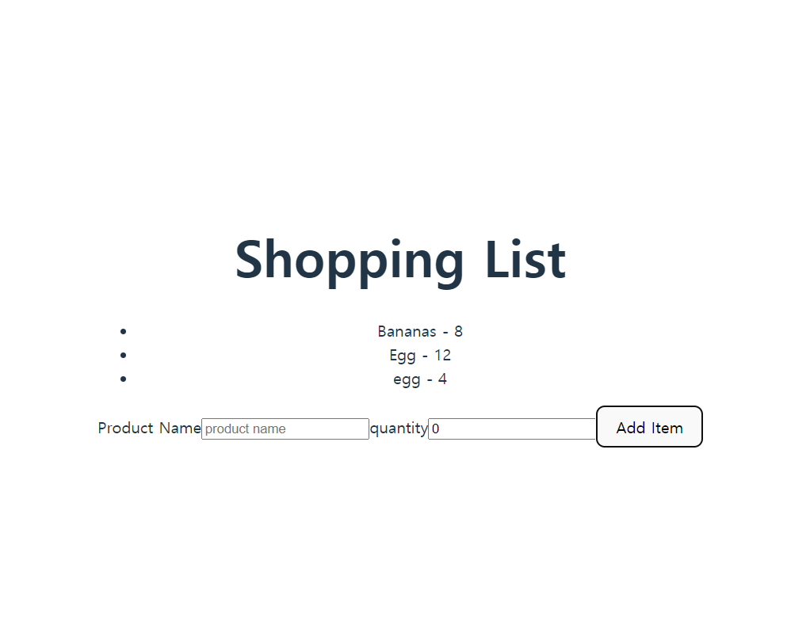

# 리액트를 이용한 form 작성

- 입력 요소별로 제약 조건을 걸어 조건에 맞는 입력값이 들어왔을 때만 제출이 가능한 form 작성을 수행해보았다.
- 입력 요소 값이 많아지면 useState 의 객체 안에 하나 하나 작성하기보단 formData객체를 활용하는 것이 간편할 수 있다는 것을 알게 되었다.

;

### 첫 화면

;

### 품목 입력

;

### 품목 등록 확인

;
